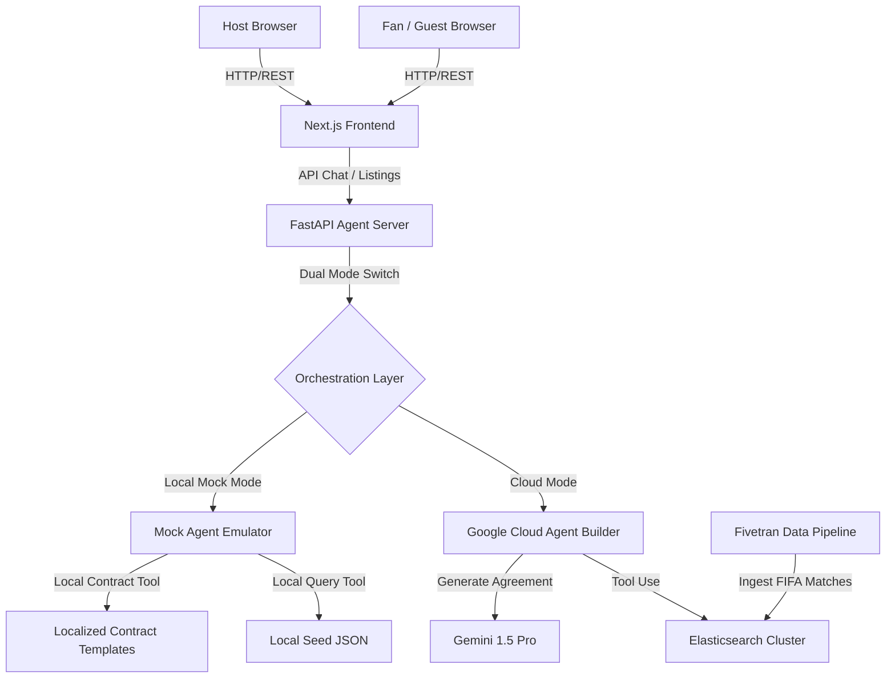

# Fanly GCP: System Architecture & Technical Specifications

Fanly is a peer-to-peer housing exchange platform designed specifically for the 2026 FIFA World Cup, hosted across New Jersey and New York City. The platform connects local hosts who have spare rooms or apartments with visiting international soccer fans, solving lodging shortages and language/logistical barriers.

---

## 1. High-Level System Architecture

The following diagram illustrates the relationship between the Next.js frontend, the FastAPI Agent API gateway, the Elasticsearch search layer, and the Gemini LLM agent tools.



---

## 2. Directory Layout & Monorepo Structure

```
Fanly-GCP/
├── agent/                       # FastAPI Python Backend
│   ├── api/
│   │   └── main.py              # API server entrypoint (Listings, Bookings, Chat)
│   ├── prompts/
│   │   └── system_prompt.txt    # LLM instruction prompt (Persona, NLU rules)
│   ├── tools/
│   │   ├── search_listings.py   # Elasticsearch vector/geo search lookup
│   │   ├── check_match_schedule.py # Elasticsearch match schedule lookup
│   │   └── generate_contract.py # Gemini contract writer generator
│   └── requirements.txt         # Python package dependencies
├── frontend/                    # Next.js 14 Web Application
│   ├── app/
│   │   ├── host/new/page.tsx    # List Your Space multi-step form
│   │   ├── listings/[id]/page.tsx # Listing details & booking drawer
│   │   ├── dashboard/page.tsx   # Tabs for hosts/fans & contract viewer
│   │   ├── globals.css          # Design system stylesheet
│   │   ├── layout.tsx           # Global wrap & SEO metadata
│   │   └── page.tsx             # Landing hero & listing search feed
│   ├── components/
│   │   ├── AgentChat.tsx        # Inline chat helper with quick chips
│   │   ├── ListingCard.tsx      # Airbnb-style feed cards
│   │   ├── MatchScheduleOverlay.tsx # Overlay showing overlapping matches
│   │   Navbar.tsx               # Branding & language navigation header
│   │   └── SearchBar.tsx        # Natural language and structured inputs
│   ├── lib/
│   │   ├── LanguageContext.tsx  # Dynamic UI state translator
│   │   ├── agentClient.ts       # Backend HTTP fetch calls wrapper
│   │   └── translations.ts      # Multi-lingual UI translations
│   └── package.json
├── data/                        # Datasets & Search Schema mappings
│   ├── schemas/
│   │   ├── listings_mapping.json # Elasticsearch listing mapping (vector fields)
│   │   └── match_mapping.json    # Elasticsearch match schedule mapping
│   ├── seed/
│   │   ├── listings.json        # Seed dataset for Harrison, Newark, Hoboken, NYC
│   │   └── match_schedule.json  # 2026 World Cup matches scheduled at MetLife
│   └── scripts/
│       └── seed_elastic.py      # Seed mapping execution Python script
├── docs/                        # Specifications & Walkthrough scripts
│   ├── architecture.md
│   └── demo_script.md
└── .gitignore
```

---

## 3. Data Schema Definitions

### 3.1 Listing Schema (Elasticsearch)
- **`listing_id`**: String (keyword)
- **`host_id`**: String (keyword)
- **`host_name`**: String (keyword)
- **`title`**: String (text)
- **`description`**: String (text)
- **`description_embedding`**: 1536-dimension float list (`dense_vector`, cosine similarity enabled)
- **`location`**: Object containing address details and a `geo_point` coordinate (`lat`, `lon`) for geographic range queries.
- **`stadium_distances`**: Object mapping travel duration and transit modes to MetLife Stadium.
- **`pricing`**: Object containing `price_per_night` and `cleaning_fee`.
- **`availability`**: Array of date availability state records.
- **`amenities`**: Array of strings.
- **`languages_spoken`**: Array of string identifiers.
- **`team_welcome`**: List of team affiliations welcomed by the host.

### 3.2 Match Schedule Schema (Elasticsearch)
- **`match_id`**: String (keyword)
- **`date`**: Date (format `yyyy-MM-dd`)
- **`time`**: String (kickoff time, keyword)
- **`stadium`**: String (venue, keyword)
- **`home_team`**: String (keyword)
- **`away_team`**: String (keyword)
- **`round`**: String (Group Stage, Round of 32, Final, keyword)
- **`expected_attendance`**: String (high, medium, low)
- **`surge_indicator`**: Boolean (active during major event matchups)

---

## 4. Agent Configuration & Capabilities

The **Fanly Assistant** agent is built using Google Cloud Agent Builder (or local SDK fallbacks) and Gemini 1.5 Pro. It handles multi-step cognitive search:

1. **Language Detection**: Automatically inspects the fan's query string and translates its response language.
2. **Entity Extraction**: Pulls date ranges, team selections, budget numbers, and languages out of unformatted paragraphs.
3. **Logistics Correlation**: Cross-references date ranges with the match schedule to report which games are playing near the host's unit.
4. **Contract Generation**: Automatically generates a plain-language hosting contract in the fan's language upon booking request acceptance.
